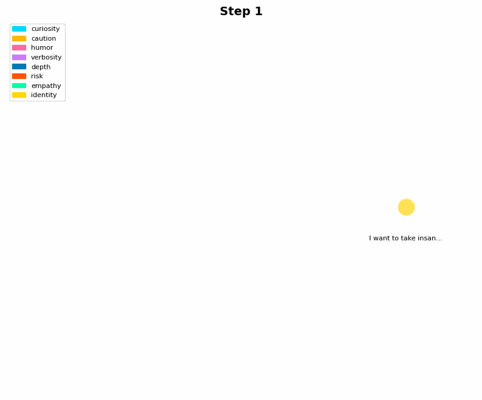

# ShadowEcology

[](https://opensource.org/licenses/MIT)
[](https://www.python.org/downloads/)

**Author:** [Bradley R. Kinnard](https://www.linkedin.com/in/brad-kinnard/) | [Aftermath Technologies](https://aftermathtech.com)

A cognitive architecture where contradictions create tension, tension mutates personality, and minds evolve through time.

## What This Is

Feed it contradictory thoughts. Watch it build a belief graph where opposing ideas coexist. See tension accumulate at the contradiction points. Then watch an 8192-bit genome mutate in response — bit flips that shift personality traits like curiosity, caution, risk tolerance.

Those mutations express as biases that reshape how an LLM responds. Not through training. Just accumulated cognitive pressure over time.



**What you're seeing above:** Neon nodes exploding in size as contradictions pile up. Hot red edges connecting opposing beliefs. The graph reorganizing as new tensions emerge. Each frame is one message processed. The colors are the 8 personality dimensions fighting for dominance.

## Current State

**What Works Right Now:**

Everything. The vault encrypts state. The lattice detects contradictions. Tension accumulates. The genome mutates. Personality shifts. The LLM responds differently.

**Real Test from Today (Dec 8):**
- Started: fresh genome, step 0
- Fed it: 10 messages full of contradictions about risk vs safety
- Result: 18 bits flipped, tension peaked at 4.9 across multiple personality dimensions
- Output: [1.3KB evolved response](demo/output/final_response.txt) that no fresh model would produce
- Visual proof: [141KB animated trace](demo/output/shadow_trace.gif) showing the whole evolution

Ran it three times in dev mode (persistent vault). Step counter went 8 → 16 → 24. The genome kept evolving. Each run produced different responses as the personality drifted.

Full test log: [`tests/results/final_test.txt`](tests/results/final_test.txt)

## How To Use

```python
from shadowecology import Shadow

# load thread data
thread = {
    "messages": [
        {"role": "user", "content": "I want to take insane risks and change the world"},
        {"role": "assistant", "content": "That sounds incredibly dangerous"},
        {"role": "user", "content": "What if we never take risks? Isn't that the real death?"},
        # ... creates explosive tension across risk/caution/identity/curiosity
    ]
}

# run shadow in demo mode (no vault/yubikey required)
shadow = Shadow(mode="demo")
trace, response = shadow.ingest(thread)

# save deep-space neon visualization
trace.save_gif("shadow_trace.gif")
print(response)
```

**What the GIF shows when it plays:**

Watch the nodes grow as tension builds. The hot red edges are contradictions forming between opposing beliefs. Gold nodes (identity) stay relatively stable while cyan (curiosity) and orange (risk) explode in size. When a node gets big enough, you see a neon glow ring pulse around it — that's peak tension right before genome mutation.

The graph reorganizes every frame. New nodes appear as beliefs are extracted from each message. Contradiction edges turn green when beliefs align. The whole thing is color-coded: cyan = curiosity, gold = identity, hot pink = humor, orange = caution/risk, spring green = empathy.

By frame 10, you can see which personality dimensions dominated the conversation. The bigger the node, the more cognitive pressure it created.

**Modes:**
- `Shadow()` — real mode (optional YubiKey + encrypted vault)
- `Shadow(mode="dev")` — passphrase only, persistent vault (recommended)
- `Shadow(mode="demo")` — ephemeral in-memory state for testing

See `demo/run.py` and `test_real_mode.py` for complete working examples.

## How It Works

1. **Belief Extraction**: Each message → beliefs with confidence scores
2. **Contradiction Detection**: New beliefs checked against existing ones for opposing sentiment in same tag domain
3. **Edge Creation**: Contradictions get -1.0 edges, agreements get 0.5 edges
4. **Tension Calculation**: Per-node tension = confidence × contradiction_count × age_factor
5. **Genome Mutation**: High tension → bit flips in affected genome segments (weighted by tag)
6. **Personality Expression**: Genome segments → 8 bias floats (0.0-1.0)
7. **Response Generation**: Biases injected into LLM system prompt
8. **Trace Capture**: Full lattice state saved per message for visualization

**Key Design Choices:**
- Identity segment mutates 20× slower than others (personality stability)
- Curiosity has hard floor of 0.30 (always maintains baseline exploration drive)
- Ultra-conservative merge (>95% overlap + same tag) to preserve contradictions
- Decay reduces confidence of inactive beliefs over logical steps

## Technical Details

**Core:**
- Python 3.12+
- Zero ML dependencies for belief/genome logic
- Pure dict-based graph (no external graph libs)
- 8192-bit genome = 1024 bytes

**Security:**
- AES-256-GCM encryption
- HKDF-SHA512 key derivation
- YubiKey HMAC-SHA1 challenge-response (optional)
- 96-bit nonces, atomic writes with fsync

**LLM:**
- llama-cpp-python with CUDA support
- Tested with Llama-3.1-8B-Instruct (Q5_K_M quantization)
- 8 bias floats injected into system prompt
- Models loaded from `shadowecology/models/` (not committed to repo)

**How the Visualization Works:**

Deep-space black background. Neon colors hand-picked to pop: electric cyan (curiosity), pure gold (identity), hot pink (humor), vivid orange (caution/risk), spring green (empathy).

Nodes grow when tension accumulates. High-tension nodes (>0.5) get pulsing glow rings. Contradiction edges are thick hot red (4px). Agreement edges are thinner bright green (3px).

The layout uses spring-force physics with slight jitter so it looks organic, not mechanical. Labels are crisp white with black stroke — readable on any screen.

Each frame = one message processed. 600ms per frame. Title shows which step you're on. File size ~140KB after aggressive palette optimization (64 colors) and disposal tricks.

## Installation

```bash
# clone repo
git clone https://github.com/moonrunnerkc/shadow-ecology.git
cd shadow-ecology

# create venv
python3.12 -m venv .venv
source .venv/bin/activate

# install deps
pip install -r requirements.txt

# download a GGUF model (not included in repo)
# place it in shadowecology/models/
# update shadowecology/oracle/local.py with the path

# run demo
python demo/run.py
```

**Requirements:**
- Python 3.12+
- CUDA-capable GPU (tested on RTX 5070, 11.5GB VRAM)
- CUDA libraries accessible (typically `/usr/local/lib/ollama/cuda_v12` or similar)
- ~6GB model file (e.g., Llama-3.1-8B GGUF)

## Why This Exists

I wanted to see what happens when you let contradictions accumulate instead of resolving them. When you let a mind hold opposing beliefs simultaneously and feel the tension from that. When personality shifts come from cognitive pressure, not gradient descent.

Every line here is human-written. No AI boilerplate, no copy-paste, no framework magic. The code is intentionally minimal — read it and you'll understand exactly what's happening.

This isn't production ML. It's an experiment. Can accumulated contradictions over time create something that feels different from a model trained on static data? I don't know yet. But the GIF above suggests something interesting is happening.

## Known Limitations

- Edge creation is sentiment-based (positive/negative keywords) — crude but effective for v1
- Tension formula is simplistic (no graph topology analysis yet)
- Merge logic is ultra-conservative (might keep too many near-duplicates)
- No save/load in demo mode (ephemeral by design)
- Model path is hardcoded (should be env var or config)

## What's Next

This is v1. It works. The pipeline runs end-to-end. But there's room to explore:

- More sophisticated contradiction detection (semantic similarity, not just keywords)
- Graph-aware tension (consider node centrality, clustering)
- Conditional belief nodes ("X when Y" logic)
- Multi-identity experiments (compare genome evolution across different data sets)
- Long-term runs (feed it data over weeks/months, see what happens)

## License

MIT License — Copyright (c) 2025 Bradley R. Kinnard

The code is open. Your mind's genome is yours alone.
